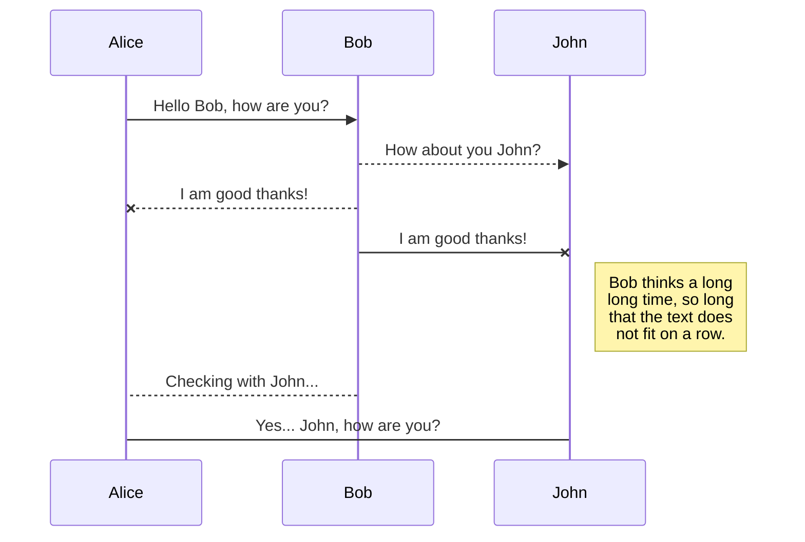

# Perfect Documentation Example

This is an example repository of building great documentation for your Github, Gitlab, Bitbucket, Gogs, Codeberg (and others like Azure Devops) repository using VSCode and some delightful extensions.

You can take the VSCode folder, apply it to your own and output great looking Markdown docs.

## Getting Started

You can clone this repo and open it up within VSCode. You'll be prompted to install a few recommended extensions (described below). Then you can ask VSCode to preview the documentation (in this case, this very readme file!) and see the final outcome :-)

## Extensions Used

* [Street Side Software: Code Spell Checker](https://marketplace.visualstudio.com/items?itemName=streetsidesoftware.code-spell-checker) - `streetsidesoftware.code-spell-checker`\
  SpellCheck your code, this extension provides the core spell-checker functionality provided to VSCode.
* [Street Side Software: Australian English](https://marketplace.visualstudio.com/items?itemName=streetsidesoftware.code-spell-checker-australian-english) - `streetsidesoftware.code-spell-checker-australian-english`\
  Dictionary for Australian English, nothing more annoying than seeing a Compromize when we say we don't want to Compromise, big surprise!  See [en-GB](https://marketplace.visualstudio.com/items?itemName=streetsidesoftware.code-spell-checker-british-english) & [the others](https://github.com/streetsidesoftware/vscode-cspell-dict-extensions?tab=readme-ov-file#languages).
* [Yu Zhang: Markdown All In One](https://marketplace.visualstudio.com/items?itemName=yzhang.markdown-all-in-one) - `yzhang.markdown-all-in-one` \
  Excellent Markdown documentation extension to help you write

## Recommended

Some recommendations to look into for extra marks :)

* [David Anson: Markdown Lint](https://marketplace.visualstudio.com/items?itemName=DavidAnson.vscode-markdownlint) - Linting with customisable rules for organisations with Markdown
* [Goessner: Markdown+Math](https://marketplace.visualstudio.com/items?itemName=goessner.mdmath) - Enable the editor to use / render TeX math and uses KaTeX under the covers

# Examples

Some examples to get you started for common needs.

## Diagrams with Mermaid

VSCode has built in support for Mermaid, so you can already use mermaid diagrams built into VSCode. See [complete examples](https://mermaid.js.org/syntax/examples.html) on the Mermaid page.

# Resources 

* [VSCode Markdown Goodies](https://code.visualstudio.com/docs/languages/markdown) - Extensive rundown on how to make the best use of VSCode for Markdown docs.